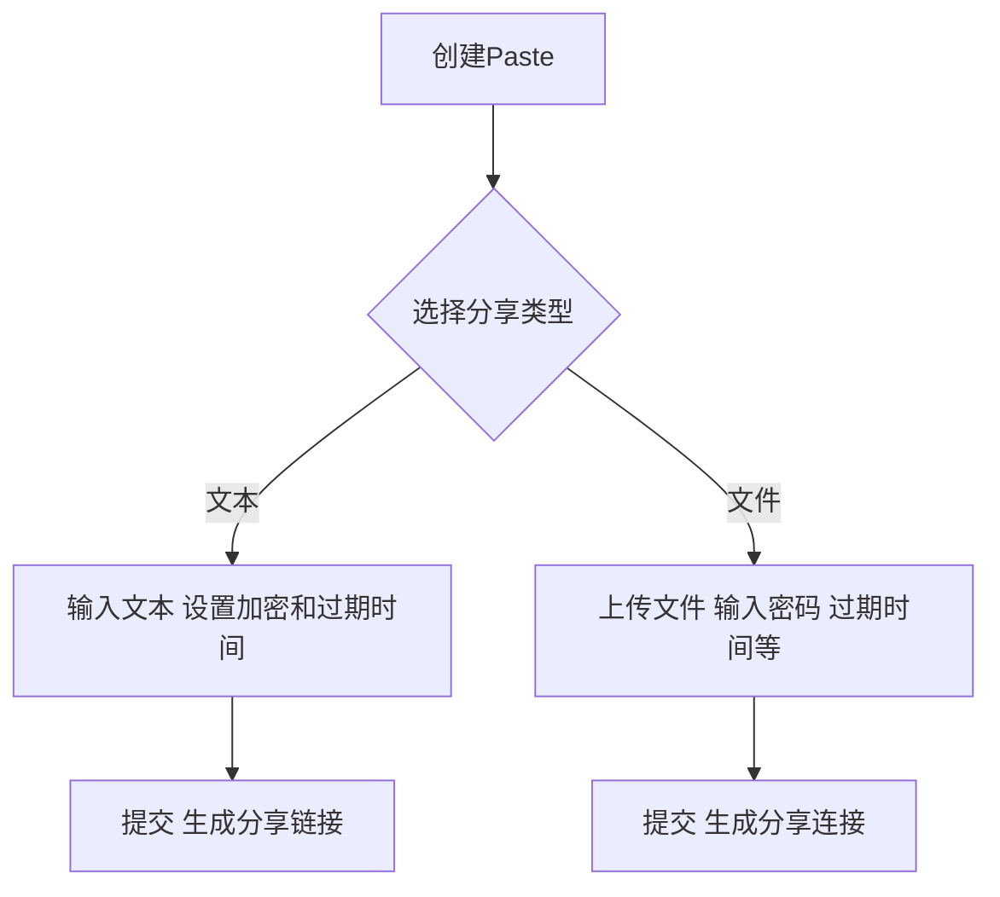
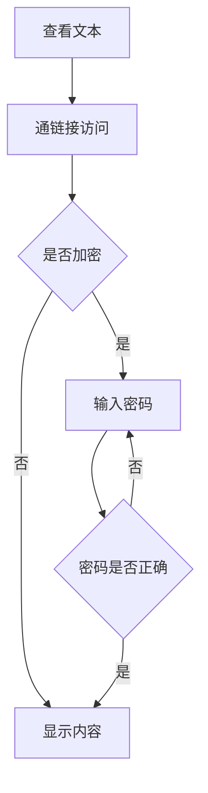
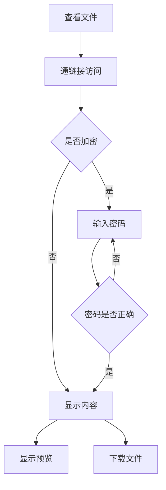

# 文件剪贴板

## 介绍

《一切皆文件》是一个众所周知的概念，文件是计算机中最基本的数据存储单位，文件可以是文本、图片、视频、音频等等。

文件剪贴板是一个可以将文件复制到剪贴板的工具，可以将文件（含字符串、图片、文件等）复制到剪贴板，然后粘贴到任何地方。

## 特色

普通的剪贴板一般情况下只能存储一些字符串，如果想要复制文件，哪怕是图片，都会比较复杂。

文件剪贴板就是为了解决这个问题而生的。支持复制文件、图片、字符串等等，提供历史记录、云同步和API。

服务器在内部使用，保证数据安全性。

## 功能

- 用户注册、登录、登出、注销
- 用户主动上传文件或者多媒体
- 历史记录的管理
  - 历史记录的筛选（按照上传时间、文件类型等）
  - 历史记录的排序（按照上传时间、文件类型等）
  - 历史记录的搜索（按照文件名、文件类型等）
  - 历史记录的删除和恢复
  - 历史记录修改
- 文件的管理
- 文件的分享（范围内分享、公开分享）
- 静态文件直接通过 API 访问（比如图片、HTML、CSS、JS等）
- 用户存储空间的管理（默认 1GB，可以通过管理员批准通过申请增加）
- ……

## 技术

- 前端：Vue.js
- 后端：FastAPI
- 数据库：PostgreSQL / MS SQL Server
- 形式：单页 Web App / PWA / Tauri / WPF+Webview2 / Winform+Webview2 / Electron ...
- 语言：JavaScript / JavaScript / TypeScript / Python / C# / Rust / shell / ...

## 参考项目

一个简单的有限功能的实现

文件存储可以考虑使用支持存文件的数据库，或者拉取云存储的 API（比如 OneDrive）。理论上 OneDrive 的 API 可以直接用，但是需要考虑到 OneDrive 的限制，以及最重要的，大陆调用 OneDrive API 的速度问题。

静态文件的挂载可以在服务器创建专门的目录，使用 FastAPI 的静态文件功能，比如 `mount` 或者 `StaticFiles`。

## 路线图

由于项目拟定的时候并没有考虑到很多现实性的因素，我们需要把项目拆分成很多期工程，慢慢地迭代。

### 第一期

就事论事，这个项目的最初雏形就是一个在线的剪贴板（暂存、分享）

功能包括：文本分享、文件分享、过期时间设置、密码保护

**可选**的功能包括：用户系统、评论区

可选的意思是，至少要预留出这部分功能后续开发的空间（比如数据库里面预留这些字段）。

#### 难点分析

##### 前端

用户创建文本类型的分享时，需要一个网页编辑器，可以使用 CodeMirror 或 Monaco Editor

用户查看文本类型的分享时，需要对文本进行高亮，可以使用 shiki 或者 Prism.js

用户查看文件类型的分享时，可以对部分类型的文件进行在线预览，比如图片、视频、音乐等简单的内容，还有pdf、word、excel 等比较复杂的预览，可以酌情做

下载文件时，后端不会直接提供直链下载，需要前端去请求后端生成临时的下载链接。

<!-- 还有部分文件可能需要支持在线的预览（如视频、音频、图片、PDF、HTML网页等）。这部分的内容可以考虑使用浏览器的内置特性；同时对于 `HTML` 文件可能需要加载其中的部分资源（如图片、CSS、JS），而这些资源本身如果存储在本项目中的单独链接，需要有一个比较容易的方式方便编写`HTML`的人引用；而如果在其他的域名下，如何保证安全的跨域访问是一个问题。 -->

在 FastAPI 里面， `FileResponse` 可以直接返回文件而表现为浏览器的下载动作；但是对于文件在新标签页打开“预览”，实现的方式主要是，响应头的 `Content-Type` 和文件的MIME类型一致。前者默认是 `application/octet-stream`，后端需要手动设置响应。

##### 后端

临时下载链接的生成

过期时间

自动处理过期文件以节约空间

#### 用户使用流程图

创建分享



查看文本类型分享



查看文件类型分享



#### 数据约定

目前处于未完成状态，等待后续更新

OpenAPI文档地址：<https://static.lnkkerst.me/open/ot-2024winter-pastebin/latest.json>
可以导入到 swager-ui 中查看：<https://petstore.swagger.io>
可以导入 apifox、postman 等工具中生成 mock 数据（就是假的、模拟出来的数据，供后端没开发出来的时候前端测试用）

#### 参考实现

只有文本分享：<https://pb.lnkkerst.me/>

只有文件分享：<https://fp.nas.lnkkerst.me:8443/>

### 第二期

完成用户系统和历史记录、文件管理。用户可以改变已经分享的文件的过期时间、删除文件、修改分享链接下面对应的文件；用户可以查看自己的历史记录，可以按照时间、文件类型、文件名等等筛选、排序、搜索……
<!-- 
### 第三期

完成管理员系统的开发，主要负责额度配给，特殊情况下可能需要手动处理用户的历史记录和文件。

管理员可以查看用户的存储空间使用情况，可以批准用户的存储空间申请——单个文件大于最大可用大小、总存储空间大于配额时扩容；完成用户存储空间的管理，用户可以查看自己的存储空间使用情况，可以申请增加存储空间。同时，管理员需要能很容易地把控服务器总共的资源使用情况。 -->

### 第三期

为了长期运行，我们的物理服务器硬盘容量可能不够，这个时候可以考虑接入一些云存储服务，比如 OneDrive；我们把用户的文件可以实际上存储在 OneDrive 上，在用户需要下载这部分文件的时候实现一个转发。在 `FastAPI` 中，用`httpx`异步请求 OneDrive 的 API，然后用`StreamingResponse` 转发这个请求结果，样例代码：

```python
import httpx
from fastapi import FastAPI

app = FastAPI()

@app.get("/{file_path:path}")
async def forward_request(file_path: str):
    onedrive_url = "https://graph.microsoft.com/v1.0/me/drive/root:/{file_path}:/content"
    headers = {
        "Authorization": f"Bearer {access_token}",
        "Content-Type": "application/octet-stream"
    }

    async with httpx.AsyncClient() as client:
        response = await client.get(onedrive_url, headers=headers, stream=True)

        headers = response.headers
        headers.pop("Content-Encoding", None)  # 移除Content-Encoding，有助于响应正常解析

        return StreamingResponse(response.aiter_bytes(), headers=headers)
```

由于一个 Microsoft E5 账号可以拥有 5TB 的 OneDrive 存储空间，这个方案可以长期使用。我们服务器端可以订购一个或者几个 E5 账号，然后把对应的存储空间分配给用户。当然了，一般情况下大文件这么处理，因为这么做自定义程度会低。
